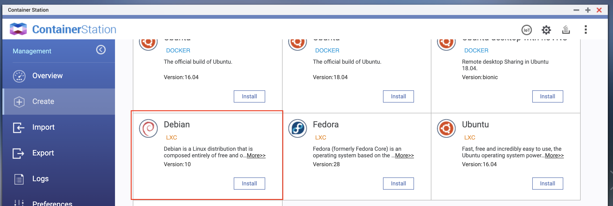
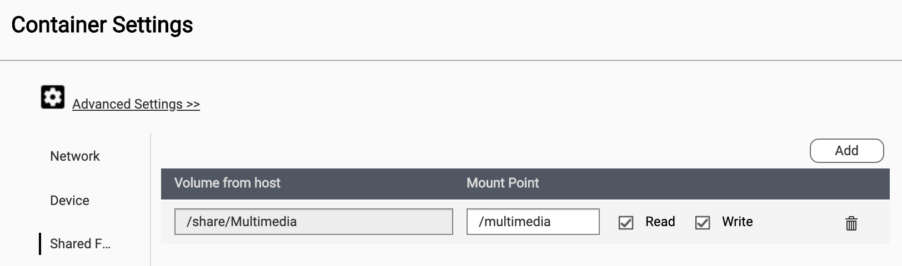

# QNAP-AFP-access
How to access files in a QNAP NAS remotely from a MacBook.

Tested on QNAP TS-453A.

# Steps
## Installation of Debian in a container and basic configuration
Create Debian container on the NAS with ContainerStation:


Share the folders you want to access:


At this point you should be able to work in the console.

Make the installation usable by refreshing packages and make installing packages possible:
```
apt-get update
apt-get upgrade
apt-get install wget
apt-get install ssh
apt-get install nano
```

Set root password (not sure if this can be skipped)
`passwd`

Create new non-root user. Authentication to root did not work even with the right configuration. See https://superuser.com/questions/543626/ssh-permission-denied-on-correct-password-authentication and https://chiedi.ubuntu-it.org/questions/52866/accesso-negato-ssh-permission-denied-publickeypassword in case of problems.
`adduser ste`

## Installation of Hamachi to create a virtual LAN and test ssh access

Download and install the right version of Hamachi from: https://vpn.net/linux.
```
wget https://vpn.net/installers/logmein-hamachi_2.1.0.203-1_amd64.deb
dpkg -i logmein-hamachi_2.1.0.203-1_amd64.deb
```

Configure Hamachi by logging in and joining the right virtual LAN: https://support.logmeininc.com/central/help/how-to-attach-an-unattached-client-to-a-logmein-account-central-t-hamachi-add-attachexisting.

At this point the Debian in the container should show up in the hamachi window on the MacBook and you should be able to ssh from the MacBook:
```
ssh ssh ste@xxx.xxx.xxx.xxx
```

## Enabling file access with AFP
Install AFP (useful guide, not very up to date though: https://mycyberuniverse.com/linux/afp-and-bonjour-under-linux.html)
`apt-get install netatalk`

Configure netatalk:

`nano /etc/netatalk/afp.conf`

An example could be:

```
[Homes]
basedir regex = /home/ste

[Multimedia]
path = /multimedia
```

Then restart the service:

`/etc/init.d/netatalk restart`

Now, install Avahi following the guide linked above.

At this point, provided that
* Hamachi is well configured and active on the MacBook
* Debian is running in a container on the QNAP with Hamachi, Natatalk and Avahi well configured and running
it will be possible to access the folder on the QNAP remotely both from the Finder Network list and by typing the right IP address in Finder/Go/Connect to Server.
